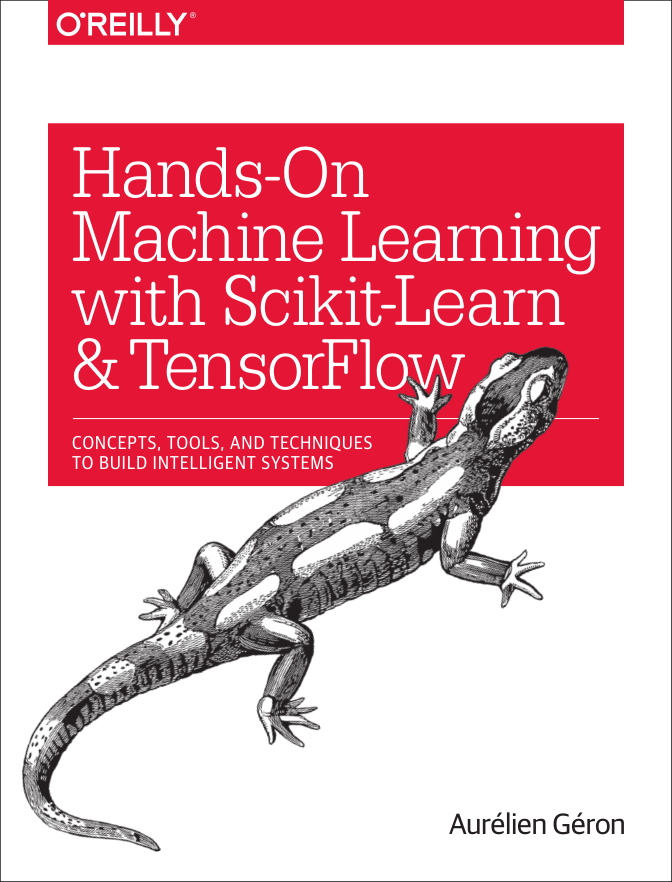

# Hands-On Machine Learning with Scikit-Learn & TensorFlow

# Scikit-Learn 与 TensorFlow 机器学习实用指南

> 不仅仅是翻译！

**电子书 pdf 下载：**

链接：https://pan.baidu.com/s/1pPWioZKaRCgz2LXKMLQdTw 提取码：3ia7 

**书中完整代码 GitHub：**

https://github.com/ageron/handson-ml

## **目录**

## **第一部分 机器学习基础**

- ### [一、机器学习概览](https://github.com/RedstoneWill/Hands-On-Machine-Learning-with-Sklearn-TensorFlow/blob/master/docs/%E4%B8%80%E3%80%81%E6%9C%BA%E5%99%A8%E5%AD%A6%E4%B9%A0%E6%A6%82%E8%A7%88.md)

- ### [二、端到端机器学习项目]()

- **未完待续**

## 最后

如果觉得我的分享对你有用，那么就 **Star** 一下吧！同时，也欢迎大家关注我的微信公众号：AI有道（ID: redstonewill）。我会一如既往发布更多更好的文章给大家！一起学习，共同进步！

**个人主页：**

>我的网站：[http://redstonewill.com/](http://redstonewill.com/)

>我的CSDN：[http://blog.csdn.net/red_stone1](http://blog.csdn.net/red_stone1)

>我的知乎：[https://www.zhihu.com/people/red_stone_wl](https://www.zhihu.com/people/red_stone_wl)
