# **1. 机器学习概览**

本章介绍的是每一个数据科学家都应该知道并听说的机器学习许多基本的概念和术语。这将是一个高层次的概括（本书唯一没有很多代码的一章）。内容很简单，但是你要保证在进行下一章之前对本章每个概念都理解得很透彻。因此，端起一杯咖啡，让我们开始吧！

## **1.1 什么是机器学习？**

机器学习是一门通过编程从而在数据中学习的科学技术，或者称之为艺术。

这里有一个更一般的定义：

_在不直接针对问题进行编程的情况下，赋予计算机学习能力的一个研究领域。_     —— Arthur Samuel, 1959

另外一个更加工程化的定义：

_对于某类任务T和性能度量P，如果计算机程序在T上以P衡量的性能随着经验E而自我完善，那么就称这个计算机程序从经验E学习。_    —— Tom Mitchell, 1997

例如垃圾邮件过滤系统就是一个机器学习程序，可以用来区分垃圾邮件和非垃圾邮件。机器学习系统用来学习的样本称之为**训练样本**（training set），每个训练样本称之为**训练实例**（training instance）或**样本**。在这个例子中，任务 T 就是要对新邮件进行区分，经验 E 就是训练数据，性能度量 P 需要定义，例如使用分类正确的邮件所占的比例。这种度量方式称之为准确率（accuracy），经常应用在分类问题中。

## **1.2 为什么使用机器学习？**

我们先来思考，使用传统编程技术如何区分垃圾邮件和非垃圾邮件呢？（如下图所示）

1.首先你应该考虑典型的垃圾邮件具有什么特点。例如在邮件的主题中包含了“4U”、“信用卡”、“免费”等词语。又或者是在邮件的发件人、邮件内容中有一些垃圾邮件常出现的特定的词语等。

2.然后你就可以对这些情况编写垃圾邮件检测算法，若一定数量的词汇检测到了，则可以判定是垃圾邮件。

3.最后验证程序，重复 1 和 2，直到检测算法的准确率足够高。

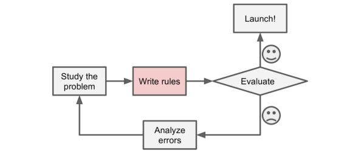

因为这个问题并不简单，你按照上面思路编写的程序可能很复杂、冗长，而且很难把控。

对比而言，同样是垃圾邮件分类，机器学习可以自动从垃圾邮件和非垃圾邮件中检测出哪些单词是经常出现在垃圾邮件中的(如下图所示)，而不需要人为指出出现哪些单词可能就是垃圾邮件。这样使得问题更加简化、容易掌控，而且分类的准确率更高。

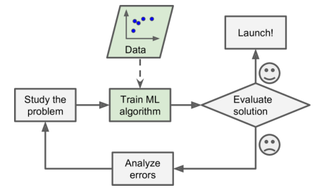

而且，如果给你发垃圾邮件的人知道了他们的关键词“4 U”被锁定的话，他们可能会把这个关键词替换成“For U”。如果使用传统编程技术，就要针对“For U”重新编写程序。那么，垃圾邮件关键词每次替换，都需要重新针对新的关键词改写程序，相当麻烦。

而机器学习则不用这么麻烦，只需将新的邮件样本交给模型，机器会自动检测出哪些单词是可能出现在垃圾邮件中的。整个过程不需要人工排查和干预（如下图所示）。

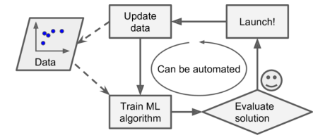

机器学习强大的另一个原因是，某些问题非常复杂，传统编程很难有较好的方案去解决。例如语音识别、图像识别，使用传统人工编程方式来解决效率低而且准确率不高。相比之下，最好的解决方法就是使用机器学习，给出足够多的数据，让机器自己去学习，得到较高的识别率。

最后，机器学习还可以帮助人们去学习（如下图所示）。为什么这样说呢？因为 ML 算法可以从数据中提取出有用和关键的信息。例如垃圾邮件分类，经过好的训练得到的 ML 模型能够揭示出哪些单词或者哪些单词的组合是预测为垃圾邮件最重要的特征参考。机器得到的这些信息可以帮助人们更好地揭示问题的本质，从而更好地解决问题。

将 ML 技术应用到大数据中，挖掘数据本身蕴含的规律和模式，这就是 _数据挖掘_。

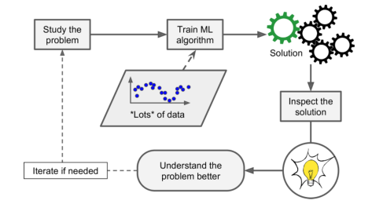

总结下来，机器学习的强大之处体现在以下几个方面：

- 传统的编程方式解决问题通常需要人工调试、建立冗长规则，而机器学习算法可以极大地简化代码且性能更好。

- 对于某些复杂问题，例如语音识别、图像识别，传统编程没有一个较好的解决方案，而机器学习通常表现得很好。

- 机器学习系统可以自适应新的数据，只需采集新的数据，重新训练 ML 模型即可。

- 机器学习可以揭示复杂问题和大数据内在规律和特性。

## **1.3 机器学习类型**

机器学习类型可以按照不同的方式来划分，具体表现在：

- 是否需要人类的监督：监督式学习、非监督式学习、半监督式学习、强化学习

- 是否可以在线上进行学习：在线学习、批量学习

- 是否可以简单地把新的数据集与已知数据集进行比较得出结果，还是从训练集中检测模式再建立预测模型：基于实例学习、基于模型学习。

当然以上这些划分方式并不是各自独立的，可以相互结合。例如一个垃圾邮件检测系统，可以是在线的、基于神经网路模型的监督式学习。

接下来我们详细看看这些机器学习类型。

### **1.3.1 监督式/非监督式学习**

机器学习可以根据再训练过程中受到的监督类型和程度进行划分，类型包括：监督式学习、非监督式学习、半监督式学习、强化学习。

**监督式学习**

监督式学习，训练集包含了样本的输出，即 label（如下图所示）。

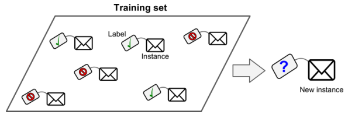

一个典型的监督式学习就是分类问题，例如垃圾邮件分类，通过对邮件内容包括它们对应的标签（垃圾、非垃圾）进行训练。最终得到的模型对新的邮件进行预测，判断它是不是垃圾邮件。

另一个典型的监督式学习就是回归问题（如下图所示），例如汽车价格预测，通过对汽车特征（商标、车龄等）包括它们对应的价格进行训练。最终得到的模型对新的汽车进行预测，得到它的价格。

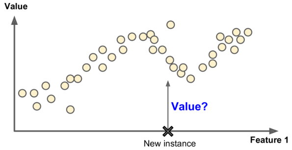

值得注意的是，有些回归算法也可以用于分类，反之亦然。例如逻辑回归（Logistic Regression）常用于分类，然而它也可以输出对应该类别的概率（例如得到垃圾邮件的概率是 20%）。

下面列举一些最常见的监督式学习算法：

- k-近邻

- 线性回归

- 逻辑回归

- 支持向量机

- 决策树和随机森林

- 神经网路

**非监督式学习**

非监督式学习，顾名思义，训练集是没有输出 label 的（如下图所示）。

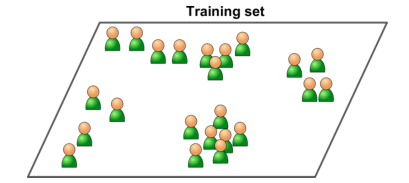

下面列举一些最常见的非监督式学习算法：

- 聚类
    
    —— k-均值
    
    —— 层次聚类分析（HCA）

    —— 最大期望算法（EM）

- 可视化和降维

    —— 主成分分析（PCA）

    —— 核 PCA

    —— 局部线性嵌入（LLE）

    —— t分布随机邻居嵌入（t-SNE）

- 关联规则学习

    —— Apriori

    —— Eclat

例如现在你掌握了你的博客访客信息，想使用聚类算法对这些访客进行分组（如下图所示）。你不需要告诉算法每个访客应该属于哪一组，聚类算法会自己分析和判断。比如访客中有 40% 是男性，喜欢看漫画书，访问博客的时间经常是晚上；20% 是年轻的科幻迷，访问博客的时间经常是周末，等等。如果你使用层次聚类分析，会对每个组划分得更细。

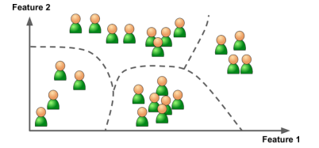

可视化算法（visualizationv algorithm）也是非监督式学习的好例子。它能够把高纬的复杂且没有标签的样本数据在 2D 或 3D 空间中展示出来，便于作图(如下图所示）。这些算法尽可能保存原始数据足够多的结构信息（例如可视化的时候避免原始输入空间不同类别的样本发生重叠）。这有助于我们理解不同类别之间的近似程度。

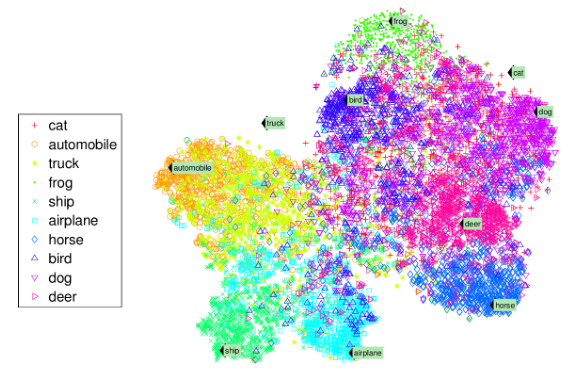

一个相关的算法叫做降维（dimensionality reduction）。目的是简化数据但是不能损失太多信息。常用的思路就是讲相似特征合并成一个。例如汽车的里程数和它的车龄关系较为密切，降维算法就是把这两个特征合并成一个特征来表征汽车的磨损程度。这种做法就是特征提取。降维的好处是减少特征个数，让算法运行更快，减小了计算成本和存储空间成本。更重要的是，降维可以消除一些噪声影响，提升算法性能。

还有一个非监督式学习的例子就是异常检测（anomaly detection）。例如检测不正常的信用卡交易来避免诈骗，捕获人工制造缺陷，或者剔除数据集中的异常点以便传替给后面的机器学习算法。异常检测算法是使用正常数据集进行训练的，得到的模型对新的样本进行测试，判断它是不是异常点（如见图所示）。


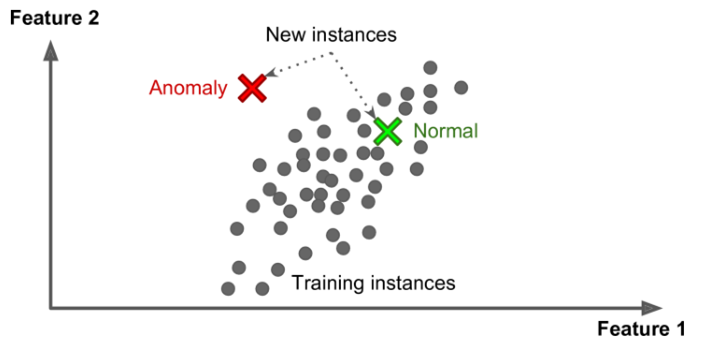

最后一个非监督式学习的例子就是关联规则学习（association rule learning）,目标就是挖掘大量数据中不同属性之前的联系。例如，通过对超市用户购买商品历史记录的分析，发现购买烧烤酱和土豆薯片的用户也倾向于购买牛排。因此，基于此分析，超市老板就可以把这些用户可能会一起买的商品放在相近的货架上，方便用户购买。

**半监督式学习**

半监督式学习，简单地说就是训练集大多数样本没有 label，只有少量样本有 label。例如一些照片托管服务，例如谷歌照片，就是一个例子。一旦你把所有家庭照片上传到服务器之后，云端算法会自动识别出每个家庭成员出现在哪些照片中，例如 A 出现在照片 1、3、5、6 中， B 出现在照片 2、3、5、8 中，这是一个非监督式学习的过程（聚类）。现在你要做的就只是告诉机器每个人的名字（相当于 label），即标注 A、B 等分别叫什么名字（监督式）。然后，机器就可以根据你给的 label，把每张照片中的每个人都标注上名字，即 label。也就是说，通过标注少量的样本，然后根据聚类算法，把所有样本的 label 都自动加上了。

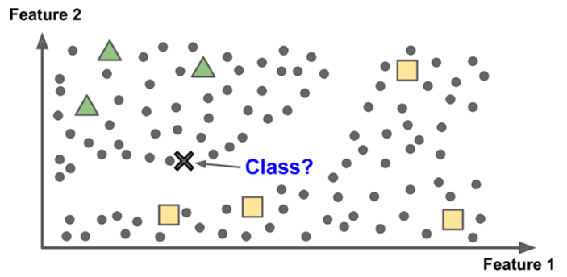

大多数半监督式学习都是监督式学习和非监督式学习相结合的。例如深度置信网络（DBNs），其基础构建模型为受限玻尔兹曼机（RBMs）。RBMs 的训练过程是非监督式学习，但是整个 DBNs 系统是使用监督式学习调优的。

**强化学习**

强化学习相对来说比较难一些。如下图所示，假设一个学习系统 Agent 可以观察环境，并做出相应的行为，然后得到相应的反馈。正确的行为得到奖励，错误的行为得到惩罚。Agent 必须自我学习最佳策略是什么，来即时获得最多的正反馈，从而实现学习的目的。策略定义为 Agent 在一个给定情境中需要做出的即时行为。

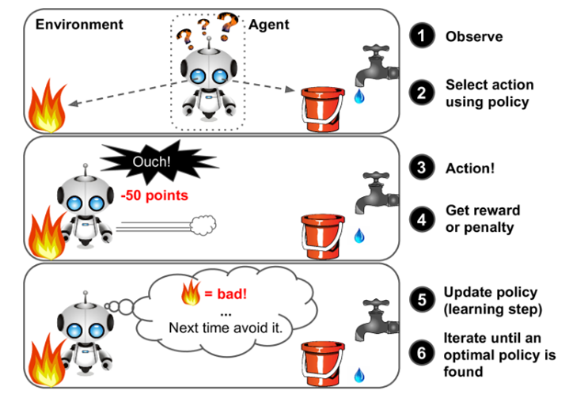

上面这张图生动形象地解释了强化学习。机器人 Agent 面临的状况是发生火灾，这时候，它必须进行决策，是选择接近火源，还是接水救火？这由 Agent 自己决定。如果 Agent 直接接近火源，那么就会得到惩罚（负反馈）。通过这样的训练，让 Agent 自己知道避免惩罚就必须远离火源，而做出取水救火的策略。强化学习可以类比成训练宠物的过程，比如我们要训练狗狗坐下，但是狗狗无法直接听懂我们的指令的。在训练过程中，我们根据狗狗的行为做出相应的反馈，如果它表现得好，我们就给他奖励，如果它做跟指令完全无关的动作，我们就给它小小的惩罚。这样不断修正狗狗的动作，最终能让它按照我们的指令来行动。

强化学习非常强大，我们熟悉的 AlphaGo 就是强化学习的典型代表。2016 年，AlphaGo 战败了世界围棋冠军李世石。它就是通过分析数百万场围棋比赛，从中学习到赢的策略，然后跟自己进行很多长比赛。经过这样的训练和学习，最终 AlphaGo 成为了一名围棋顶尖高手。

### **1.3.2 批量学习和在线学习**

机器学习类型另一种分类方式是根据是否可以对新添加的数据进行在线的即时学习。如果可以的话就叫在线学习（online learning），如果是离线的话就叫批量学习（batch learning）。

**批量学习**

批量学习不是即时学习，它是将所有的训练数据一起训练，这会花费很多时间和计算资源，所以一般只能用离线的方式训练。模型一旦训练完成，就上线发布，使用固定的模型工作，所以也常称为离线学习（offline learning）。

这时候如果有新的数据产生，想要得到新的模型必须把新的数据和之前的数据结合起来，再次重新离线训练机器学习模型，最后上线发布。

批量学习比较简单也是最常见的机器学习类型。但是，一次完整的训练过程可能会花费很多时间，甚至几天、一个星期都有可能。如果机器学习系统更新数据很频繁，那么使用这种离线方式训练就比较麻烦，成本很大，需要不停地整合数据、离线训练、发布模型。这种情况下，批量学习并不是一个好方法。

而且，训练整个数据集需要很多的计算资源（例如 CPU/GPU、内存、存储、IO、网络等）。特别是再数据量很大的情况下，其消耗的资源和成本是巨大的。这时候，一般不建议使用批量学习模型。

最后，如果你的系统需要能够自主学习，且资源有限（例如手机 App），那么携带大量数据、消耗大量资源，每天花费数小时来进行模型训练是不太现实的。

**在线学习**

在线学习可以即时地重新训练模型，当新的数据点或者小批量（mini-batches）数据传给模型的时候，模型立即根据新数据重新训练。整个过程快速而且成本低。这是一种在线学习的方式，如下图所示。

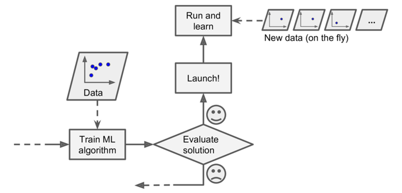

在线学习对于那些持续接受数据（例如，股票价格）并且需要快速更新或自主学习的系统非常有用。如果你的计算资源有限，在线学习也是一个不错的选择：一旦在线学习系统了学习了新的数据实例，它就不再需要它们了，因此可以丢弃（除非您想要回滚到以前的状态并“重播”数据）。这样可以节省大量的空间。

在线学习算法也可以应用于当数据集很大，机器内存不够的时候进行模型训练（称为核外学习，out of core learning）。做法是把整个数据集切分成许多小批量（mini-batches）样本，依次对每个小批量样本进行训练，重复进行，直到整个数据集完成训练（如下图所示）。值得注意的是，整个过程一般是离线进行的，所以在线学习这个名字可能有点让人疑惑，你也可以称之它为增量学习（incremental learning）。

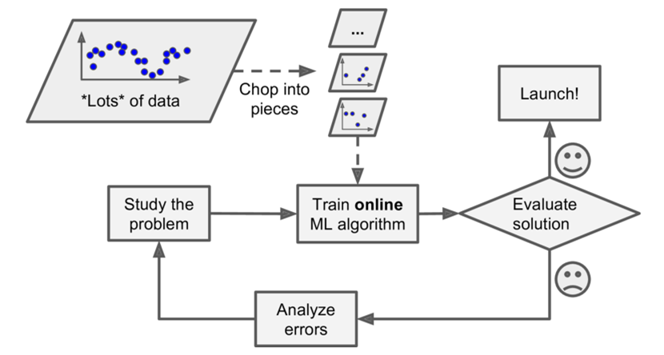

在线学习一个很重要的参数就是基于数据改变更新算法的频率，是只要有新的数据进来就更新算法还是积累一定的数据改变之后再更新算法。这个参数被成为：学习率（learning rate）。如果设置很大的学习率，算法对会快速适应新数据，而忘记旧的数据（然而，垃圾邮件检测系统中你可能并不想让模型只对新的垃圾邮件标记，而很快舍弃之前的标记方法）。相反，如果设置较小的学习率，系统就会具有较大的惯性。也就是说，学习的速度比较慢，但是对数据中可能存在的噪声就不会特别敏感。系统的健壮性就会更强一些。

在线学习一个大的挑战是只要有坏数据输入给系统，那么系统的性能就会立刻逐步下降。如果这是一个即时系统，用户就会立刻注意到。例如，坏数据可能来自于机器人上的故障传感器，可能是某人在搜索引擎输入垃圾信息以提高搜索排名。为了减少这种风险，您需要密切监视系统，如果检测到系统性能下降，就立即关闭学习（或回滚到上一个版本的系统）。您可能还需要监视输入数据并对异常数据作出反应（例如，使用异常检测算法）。

### **1.3.3 基于实例学习 vs 基于模型学习**

机器学习还可以就根据它的归纳方法来划分。大多数机器学习的任务是做出预测，这意味着给到大量的训练样本训练模型，系统需要泛化到从未见过的样本。模型在训练集上有好的表现是个好事，但这还不够；目标是模型在新的实例上的表现。

有两种主要的归纳方法：基于实例学习和基于模型学习。

**基于实例学习**

或许最简单的学习方式就是记忆学习。如果你用这种方式创建一个垃圾邮件过滤器，它只会标记所有与已经由用户标记的邮件相同的邮件。这不是最坏的解决方案，但肯定不是最好的。

不能仅仅是标记与已知邮件相同的邮件，你的垃圾邮件检测程序还应该可以标记与已知邮件相似的邮件。这就需要计算两封邮件的相似程度。一种最基本的相似度测量方式就是计算两封邮件包含相同单词的个数。如果新邮件与已知的一封垃圾邮件相同单词个数较多，那么系统就会判断其也是垃圾邮件。

这种学习方法就叫做基于实例学习：系统把所有训练集样本都存储下来，然后计算新的样本与存储的这些实例的相似度（如下图所示）。

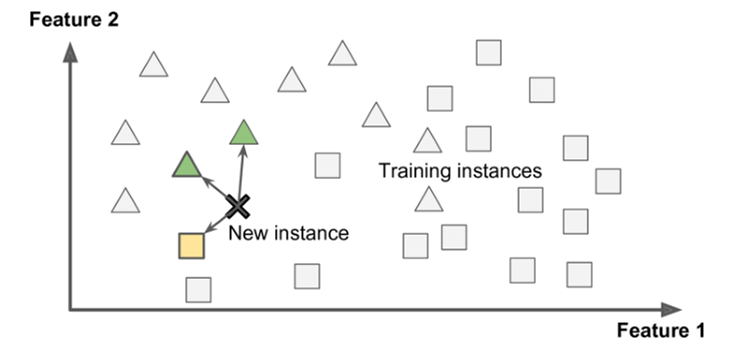

**基于模型学习**

另一种归纳方法就是使用所有训练集样本建立一个模型，然后使用这个模型预测新的样本。这中学习方法就叫做基于模型学习（如下图所示）。

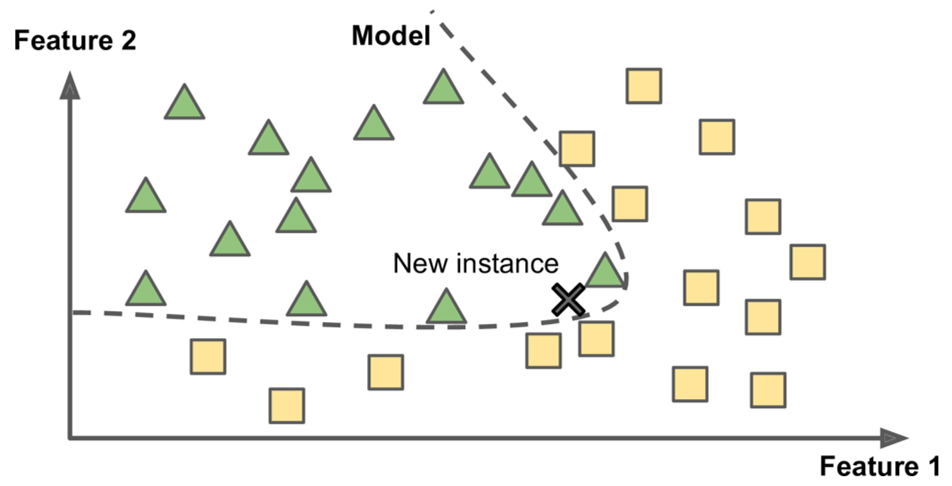

例如，假设你想知道是否钱能让人快乐，因此，你从 [OECD](https://stats.oecd.org/index.aspx?DataSetCode=BLI) 网站上下载 Better Life Index 数据，从 [IMF](https://www.imf.org/external/pubs/ft/weo/2016/01/weodata/weorept.aspx?pr.x=32&pr.y=8&sy=2015&ey=2015&scsm=1&ssd=1&sort=country&ds=.&br=1&c=512%2C668%2C914%2C672%2C612%2C946%2C614%2C137%2C311%2C962%2C213%2C674%2C911%2C676%2C193%2C548%2C122%2C556%2C912%2C678%2C313%2C181%2C419%2C867%2C513%2C682%2C316%2C684%2C913%2C273%2C124%2C868%2C339%2C921%2C638%2C948%2C514%2C943%2C218%2C686%2C963%2C688%2C616%2C518%2C223%2C728%2C516%2C558%2C918%2C138%2C748%2C196%2C618%2C278%2C624%2C692%2C522%2C694%2C622%2C142%2C156%2C449%2C626%2C564%2C628%2C565%2C228%2C283%2C924%2C853%2C233%2C288%2C632%2C293%2C636%2C566%2C634%2C964%2C238%2C182%2C662%2C453%2C960%2C968%2C423%2C922%2C935%2C714%2C128%2C862%2C611%2C135%2C321%2C716%2C243%2C456%2C248%2C722%2C469%2C942%2C253%2C718%2C642%2C724%2C643%2C576%2C939%2C936%2C644%2C961%2C819%2C813%2C172%2C199%2C132%2C733%2C646%2C184%2C648%2C524%2C915%2C361%2C134%2C362%2C652%2C364%2C174%2C732%2C328%2C366%2C258%2C734%2C656%2C144%2C654%2C146%2C336%2C463%2C263%2C528%2C268%2C923%2C532%2C738%2C944%2C578%2C176%2C537%2C534%2C742%2C536%2C866%2C429%2C369%2C433%2C744%2C178%2C186%2C436%2C925%2C136%2C869%2C343%2C746%2C158%2C926%2C439%2C466%2C916%2C112%2C664%2C111%2C826%2C298%2C542%2C927%2C967%2C846%2C443%2C299%2C917%2C582%2C544%2C474%2C941%2C754%2C446%2C698%2C666&s=NGDPDPC&grp=0&a=) 网站上下载 GDP 数据。然后就可以根据人均 GDP 和生活满意度建立对应的表格，如下所示。

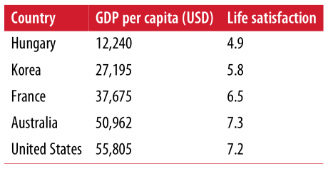

下面画出一些国家人均 GDP 与生活满意度之间的关系散点图：

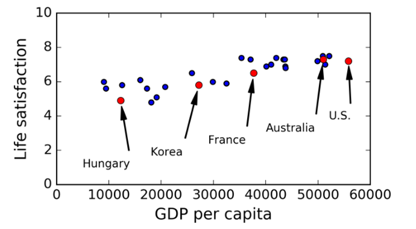

似乎能看到一点趋势。尽管数据有些噪声，但是生活满意度多少与 GDP 呈现线性增长关系。因此，你可以令生活满意度是人均 GDP 的线性函数。这一步称为模型选择：选择一个生活满意度的线性模型，该模型只有一个属性（attribute），即人均 GDP。

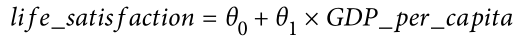

这个模型有两个参数：$\theta_0$ 和 $\theta_1$，通过调整这些参数，你可以让你的模型表示任何线性函数，如下图所示。

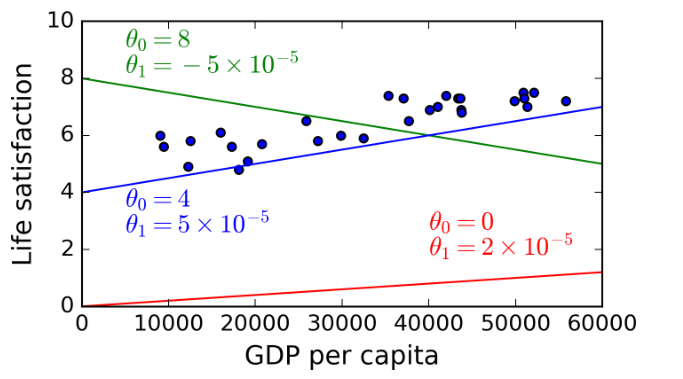

在使用你的模型之前，你需要确定参数值 $\theta_0$ 和 $\theta_1$ 让模型表现最好。怎么做呢？你需要制定一个性能评估方法。可以定义一个拟合函数测量模型有多好，也可以定义一个代价函数（loss function）来测量模型有多不好。对于线性回归问题，人们一般使用代价函数来测量线性模型预测值与实际样本值之间的距离，目标就是让这个距离越小越好，最小化。

这就是线性回归算法，根据训练集，线性回归算法能够找到最合适的参数，使得线性模型能最好程度地拟合这些数据。这个过程称为模型训练。在上面这个例子中，使用线性回归算法，得到的最佳参数为：$\theta_0 = 4.85$，$\theta_1 = 4.91 × 10^{-5}$。

现在得到的线性模型拟合数据的效果就很好了，如下图所示。

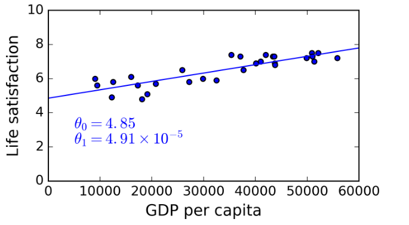

最后，你就可以使用这个模型进行预测了。例如，你想知道 Cyprus 人的生活满意度，但是 OECD 并没有提供这个数据。幸运的是，你可以使用刚刚训练好的模型进行预测：你查到 Cyprus 人均 GDP 是 $22,587，然后根据模型的线性表达式，计算生活满意度为：$4.85 + 22,587 × 4.91 × 10^{-5} = 5.96$。

下面这段代码就是使用 Python 来导入数据集，预处理，创建可视化散点图，然后训练线性模型并作出预测。

```
# Code example
import matplotlib
import matplotlib.pyplot as plt
import numpy as np
import pandas as pd
import sklearn.linear_model
import os
datapath = os.path.join("datasets", "lifesat", "")

def prepare_country_stats(oecd_bli, gdp_per_capita):
    oecd_bli = oecd_bli[oecd_bli["INEQUALITY"]=="TOT"]
    oecd_bli = oecd_bli.pivot(index="Country", columns="Indicator", values="Value")
    gdp_per_capita.rename(columns={"2015": "GDP per capita"}, inplace=True)
    gdp_per_capita.set_index("Country", inplace=True)
    full_country_stats = pd.merge(left=oecd_bli, right=gdp_per_capita,
                                  left_index=True, right_index=True)
    full_country_stats.sort_values(by="GDP per capita", inplace=True)
    remove_indices = [0, 1, 6, 8, 33, 34, 35]
    keep_indices = list(set(range(36)) - set(remove_indices))
    return full_country_stats[["GDP per capita", 'Life satisfaction']].iloc[keep_indices]

# Load the data
oecd_bli = pd.read_csv(datapath + "oecd_bli_2015.csv", thousands=',')
gdp_per_capita = pd.read_csv(datapath + "gdp_per_capita.csv",thousands=',',delimiter='\t',
                             encoding='latin1', na_values="n/a")

# Prepare the data
country_stats = prepare_country_stats(oecd_bli, gdp_per_capita)
X = np.c_[country_stats["GDP per capita"]]
y = np.c_[country_stats["Life satisfaction"]]

# Visualize the data
country_stats.plot(kind='scatter', x="GDP per capita", y='Life satisfaction')
plt.show()

# Select a linear model
model = sklearn.linear_model.LinearRegression()

# Train the model
model.fit(X, y)

# Make a prediction for Cyprus
X_new = [[22587]]  # Cyprus' GDP per capita
print(model.predict(X_new)) # outputs [[ 5.96242338]]
```
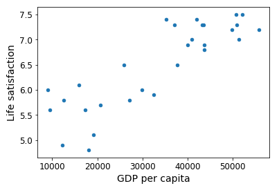

> [[ 5.96242338]]

值得注意的是，如果我们使用的是基于实例的方法学习，我们发现与 Cyprus 人均 GDP 最接近的国家是 Slovenia（人均 GDP 为 $20,732）。因为 Slovenia 人的生活满意度是 5.7，则可以说 Cyprus 的生活满意度也是 5.7。如果我们选择与 Cyprus GDP 最接近的 3 个国家，分别是 Portugal、Slovenia、Spain，GDP 分别是 5.1、5.7、6.5，则平均计算，得到 Cyprus 的人均 GDP 为 5.77。这两个结果与我们使用基于模型学习的结果很相近。这种实例学习方法就叫做 k-近邻算法。

对应到代码中，如果使用 k-近邻替代线下回归，则只要把下面这条语句：

```
clf = sklearn.linear_model.LinearRegression()
```

替换成：

```
clf = sklearn.neighbors.KNeighborsRegressor(n_neighbors=3)
```

就好了。

如果一切进展顺利的话，这个模型就可以较好地预测了。如果效果不好，那你还需要使用更多的特征（例如就业率、健康程度、空气质量等），获得更好的训练集，或者使用更强大的模型（例如多项式回归）。

下面对基于模型学习作个总结：

- 选取数据集

- 选择模型

- 在训练集上训练模型（即使用学习算法找到最佳参数，让代价函数最小化）

- 最后，将模型应用到新的样本中，进行预测，希望的得到较好的泛化能力

这就是构建一个典型的机器学习项目的过程。

到目前为止，我们已经介绍了很多内容：你知道了什么是机器学习，为什么机器学习是有用的，机器学习有哪些类型，以及构建机器学习系统的一般流程是什么样的。接下来，我们来看一下机器学习中有哪些影响模型性能准确率的因素和困难。

## **1.4 机器学习的主要挑战**

简而言之，因为机器学习的主要任务就是选择合适的机器学习算法在数据集上进行训练，所以不好的算法和不好的数据都可能严重影响训练效果。下面我们先来看看不好的数据会带来什么影响。

### **1.4.1 训练数据不足**

对一个蹒跚学步的孩子来说，如何识别苹果？方法是拿出很多各种各样颜色、形状的苹果图片给他看，教他。这样，孩子就能够更好地识别出各种苹果。

而对机器学习来说还达不到这种程度，大多数机器学习算法都需要很多数据才能有不错的表现。即使是简单的算法可能也需要上千个训练样本。对于复杂的机器学习问题，例如图像识别、语音处理，需要的训练样本就更多了，甚至是百万级别的（除非你基于已有的模型进行再次训练，类似于迁移学习，所需的样本可能不多）。

**数据的不合理有效性**

在 2001 年发表的[著名文章](http://goo.gl/R5enIE)里，微软研究员 Michele Banko 和 Eric Brill 展示了不同的机器学习算法在一个较复杂的自然语言消歧问题上的表现情况，他们发现一旦有足够多的训练数据，各算法的表现都基本一致（如下图所示）。


正如作者所说：“这个结果表明我们可能需要重新考虑是花费时间、金钱在算法研究上还是在扩充语料库上。”

对于复杂问题，数据比算法更加重要这一思想在 Peter Norving 等人于 2009 年发布的文章《[The Unreasonable Effectiveness of Data](http://goo.gl/q6LaZ8)》中得到进一步的推广。值得注意的是，小型和中等数量的数据集仍然非常常见，而且想要获得大量的训练数据通常并不是一件简单的事情，所以还不能抛弃算法。

### **1.4.2 没有代表性的训练数据**

为了让模型有更好的泛化能力，很重要的一点是你的训练数据应该有很好的代表性，无论你使用的是基于实例学习还是基于模型学习。

例如，之前我们训练线性模型选择的一些国家并不具有很好的代表性，缺少了一些国家。下图展示了增加这些国家之后的数据分布和线性模型。

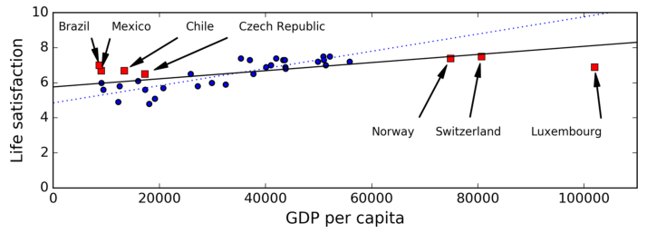

如果你在这些完整的数据上训练线性模型，得到的黑色实线；原来的线性模型是蓝色虚线。如你所见，添加几个缺失的国家后不仅显著地改变了模型，而且清楚地表明，这种简单的线性模型可能永远都不会有很好的性能。看起来，非常富裕的国家并不比中等富裕国家幸福（事实上，他们似乎更不幸福），相反，一些穷国似乎比许多富裕国家更加幸福。

如果使用没有代表性的数据进行训练，模型不可能得到准确的预测，特别是那些非常贫困和非常富有的国家。

使用有代表性的训练数据是非常重要的。但这通常比较困难，如果样本太少，容易引入采样噪声（即非代表性的数据）；即使是很多样本，如果采样方法有缺陷，也可能得到不好的数据，这被称为采样偏差（sampling bias）。

**一个著名的采样偏差例子**

或许最有名的采样偏差例子发生在 1936 年的美国大选，林轩田课程中也提到过这个例子。当时的候选人是 Landon 和 Roosevelt，《Literary Digest》做了一次很大的民意调查，给 10，000，000 选民发送邮件征集选民意向，总共收到了 2，400，000 的反馈结果。调查报告显示 Landon 的支持率是 57%，但是最终选举投票 Roosevelt 得到了 62% 的选票赢了 Landon。差别如此之大的原因在于《Literary Digest》的民意调查采样方法有缺陷：

- 首先，《Literary Digest》发送邮件的选民大部分都是美国富人，而这些富人支持共和党（即 Landon）的较多。

- 其次，只有不到 25% 的人反馈了民意调查。这同样引入了采样偏差，排除了那些对选举不关心的，或者不喜欢《Literary Digest》的，或者是其他关键组织。这种采样偏差被称为无应答偏差（nonreponse bias)。

还有一个例子，假如你想构建一个系统来识别 funk 音乐视频。得到训练集的方法之一就是在 YouTube 上搜索 “funk music”，得到的视频作为训练集，但这是假设 YouTube 搜索引擎返回的是所有具有代表性的 funk music。事实上，搜索结果可能偏向于推荐某些有名的音乐家（跟你的所在地、平时喜好都有关系）。

### **1.4.3 低质量数据**

显然，如果训练数据都是错误、离群点和噪声（例如，由于质量不佳的测量），想要得到一个性能较好的模型是非常困难的。因此，花费时间清洗训练数据是十分必要的，这也是数据科学家们非常重视的。常用的方法如下：

- 对于离群点，通常的办法是剔除这个实例或者手动修正这个错误。

- 对于有特征缺失值的情况，可以选择删除这个特征，或者删除缺失特征的实例样本，或者填充缺失值（中值或平均值），或者分别训练包含该特征和不包含该特征的两个模型对比效果等方法。

### **1.4.4 不相关特征**

俗话说：种瓜得瓜，种豆得豆。如果训练数据包含了足够的相关特征，没有太多的不相关特征，模型就有能力学习。机器学习如此强大的一个重要原因就是提取一些重要的特征来训练。提取特征并处理的过程我们称之为特征工程，具体包含以下几个方面：

- 特征选择：从所有特征中选择最有用的特征供模型来训练。

- 特征提取：结合已有的特征产生更有用的特征(例如降维技术)。

- 通过收集新数据创建新特征。

以上就是一些不好的数据类型，接下来我们将介绍有哪些不好的算法。

### **1.4.5 过拟合**

举个形象的例子，比如你去某个国家旅游搭乘出租车，半路上司机把你丢在路边,你可能会说这个国家的出租车司机都是坏蛋！这种过度概括的行为是人类经常做的。同样不幸的是，机器有时候也会出现类似的情况，机器学习里称之为过拟合：表示模型在训练数据上表现的很好，但是在其它样本上表现得却不好，泛化能力差。

下图展示了使用高阶多项式模型来拟合生活满意度与人均 GDP 的关系。尽管在训练数据上该高阶模型表现比简单的线性模型好得多，但是你真的相信这是一个很好的模型吗？

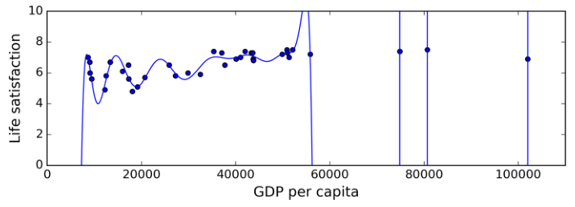

诸如深层神经网络这种复杂模型可以检测出数据中的细微模式，但是如果训练集包含噪声，或者样本不多（带来采样噪声），模型很可能会检测到噪声本身的模式。很明显这些模式无法很好地泛化到其它样本中。例如，生活满意度模型中，采用国家名称这一属性作为特征之一，发现所有训练样本中国家名称包含字母 w 的生活指数都大于 7：New Zealand (7.3), Norway (7.4), Sweden (7.2), Switzerland (7.5)。这种结论你觉得能归纳到训练样本以外的其它样本吗？例如 Rwanda、Zimbabwe？显然是不行的，这一模式只是偶然发生在训练数据中，但是模型本身没有办法判断一个模式是真实反映数据内在特征的还是数据中噪声造成的。

当模型过于复杂时，容易发生过拟合，常用的解决方法是：

- 选择少量的参数作为特征，简化模型（例如使用线性模型而不是高阶模型）。

- 获取更多的训练数据

- 减少训练数据中的噪声（例如修复数据中的错误，移除离群点）。

限制模型复杂度，让它变得简单，减少过拟合风险的做法称之为正则化（regularization）。例如，我们之前定义的线性模型包含两个参数 $\theta_0$ 和 $\theta_1$。这给了学习算法两个自由度来让模型适应训练数据：可以调试直线的截距 $\theta_0$ 和斜率 $\theta_1$。如果令 $\theta_1=0$，则算法只有一个自由度，很难较好地拟合数据：可以做的仅仅是把这条水平线上下移动，尽量接近训练样本，最终停留在所有训练样本的均值位置。这确实是一个非常简单的模型！如果 $\theta_1\neq0$，但值很小，学习算法有效的自由度在一和二之间，它比两个自由度模型简单，比一个自由度模型复杂。其实，你的目标就是在完美拟合数据和简化模型之间找到平衡，使模型具有较好的泛化能力。

下图展示了三种模型：蓝色点线表示原始的线性模型，缺少一些国家的数据；红色短划线表示第二个线性模型，使用了所有国家的数据训练得到的；蓝色实线表示的模型与第一个类似，只是使用了正则化限制。可以看出正则化使得模型的斜率变小，对训练数据的拟合效果比第一种差一些，但是对新样本的拟合效果比第一种更好，泛化能力变强了。

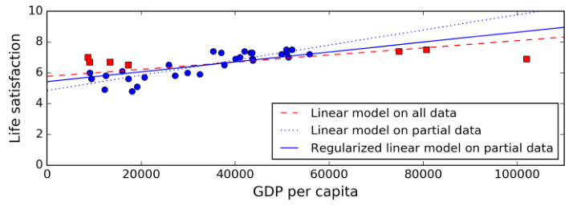

正则化的程度由超参数控制。超参数是算法的参数（不是模型的参数），不受算法本身的影响。超参数在训练模型之前就设置好，整个训练过程中保持不变。如果将超参数设置很大的值，将会得到一个近似平坦的模型（斜率接近 0 ）。这时候不太可能出现过拟合，但是模型过于简单，对数据的拟合效果很差。这种情况叫做欠拟合，它和过拟合是两个对立的概念。调试超参数是构建机器学习系统过程中非常重要的一步，下一章节我们想详细介绍。

### **1.4.6 欠拟合**

正如上文所说，欠拟合是与过拟合对立的概念：它发生在模型过于简单以至于不能很好地拟合数据的时候。例如，生活满意度的线性模型就可能存在欠拟合，实际的模型可能要比线性模型更加复杂。因此，线性模型即便是对训练样本也会预测得不够准确。

解决欠拟合得主要方法有：

- 选择更加强大得模型，带有更多参数。

- 增加更好得特征到学习算法中（特征工程）。

- 减小对模型的限制（例如减小正则化超参数）。

### **1.4.7 回顾**

到目前为止，我们已经学习了很多机器学习概念知识，下面做个简单回顾：

- 机器学习就是让机器能够从数据中学习，在某些任务中做得更好，而不是简单地执行固定的程序。

- 机器学习类型有很多：监督式和非监督式，批量学习和在线学习，基于实例学习和基于模型学习等。

- 在一个机器学习工程中，我们收集数据作为训练集，使用学习算法在训练集上进行训练。如果算法是基于模型的，得到最佳的模型参数，使模型能够拟合训练集，并且对训练集之外的样本也能有较好的拟合效果。如果算法是基于实例的，学习过程就是简单的记忆，并使用相似性测量来归纳到新的样本中。

- 以下因素可能造成系统表现不好：训练集样本太少，数据不具有代表性，数据有噪声，受到不相关特征的污染。最后，模型不能过于简单（欠拟合），也不能过于复杂（过拟合）。

还有一点需要讨论：一旦训练了一个模型，不能仅仅是“希望”它的泛化能力好，我们还要去评估这个模型，必要的时候调试模型。下面就来介绍怎么去调试模型。

## **1.5 测试和验证**

评估模型好坏的唯一方法就是测试模型在新样本中的表现。一种做法是把模型直接放到生产中实际检测其表现。但如果模型性能不佳，会让用户抱怨吐槽——因此，这并不是一个好方法。

一种更好的做法是把数据集划分成两部分：训练集和测试集。顾名思义，训练集用来训练模型，测试集用来评估模型。模型在新样本下的错误率被称为泛化误差（又叫样本外误差，out-of-sample error）。模型在测试集上评估模型，得到的误差可以近似认为就是模型的泛化误差。一般使用整个数据集的 80% 作为训练集，20% 作为测试集。

如果模型的训练误差（模型在训练集上的误差）很小，而泛化误差很大，则说明模型很可能发生了过拟合。

这下，评估模型变得简单了：使用测试集即可。如果有两个模型（一个线性模型，一个多项式模型），如何决定哪个模型更好呢？方法就是直接训练两个模型，然后比较它们在测试集上的泛化误差大小就可以了。

还有一个问题，如何选择最佳的正则化超参数呢？一种方法就是分别使用不同的超参数训练模型，然后比较各个超参数对应模型的泛化误差（泛化误差在测试集上得到），对应泛化误差最小（例如 5%）的超参数即为最佳值。

然后，将模型上线发布，但不幸的是模型表现却并不像测试时那么好，实际误差达到了 15%。这又是为什么呢？

问题在于我们是在同一测试集上多次测量泛化误差的，这样产生的最佳模型是适应测试集的，可能造成模型在测试集之外新的样本上表现得不太好。

解决这一问题通常的做法是除了设置训练集、测试集之外，还设置一个验证集。同样使用训练集来训练不同超参数的模型，每个模型在验证集上进行验证，选择表现最好的超参数对应的模型，最后该模型在测试集上进行测试得到的误差为最终的泛化误差。

为了避免验证集占用过多的训练样本，造成浪费，通常使用交叉验证（cross-validation）：将整个训练集划分为 N 份，取其中的 N-1 份作为训练集，另外的 1 份作为验证集，重复 N 次。然后将 N 次的验证误差求平均作为验证误差。一旦模型和超参数选定之后，使用该模型和超参数，在整个训练集上进行训练。最后，在测试集上测试得到泛化误差。

**无免费午餐定理**

模型是样本观测的一种简化。简化意味着丢弃一些多余的不具备泛化能力的细节。然而，决定哪些数据保留，哪些数据抛弃，我们必须做出假设。例如，一个线性模型假设数据是呈线性关系的，实例与直线之间的距离仅仅是噪声，是可以忽略的。

在 1996 年的一篇[著名论文](http://goo.gl/3zaHIZ)中，David Wolpert 证明了如果对数据不作任何假设，选择一个模型而不选择其它模型是没有理由的。这被称为无免费午餐（NFL）定理。对某些数据集来说，最好的模型是线性模型，而对于另外某些数据集来说，最好的模型可能是神经网络。没有哪个模型一定是最好的（正如这个定理的名字那样）。确定哪个模型最好的唯一方法就是对所有的模型进行评估，但是这显然不太可能。实际上我们通常会对数据作出某些合理的假设，仅仅评估一些合理的模型。例如，我们可能设置不同的正则化参数来评估线性模型；对于更复杂的问题，可能评估不同的神经网络模型。

## **1.6 习题**

1.如何定义机器学习？

2.列举机器学习可以解决的四类问题？

3.什么是带标签的训练集？

4.最常见的两个监督式学习是什么？

5.列举四个常见的非监督式学习。

6.让机器人在各种未知的地形上行走，这是哪种机器学习算法？

7.把用户分成不同的组别，这是哪种机器学习算法？

8.垃圾邮件检测是监督式学习还是非监督式学习？

9.什么是在线学习系统？

10.什么是核外学习？

11.哪种机器学习类型是基于相似度测量来进行预测的？

12.模型参数和算法超参数有何不同？

13.基于模型的学习算法搜索的是什么？它的常用策略是什么？如何作出预测？

14.列举机器学习四个主要挑战。

15.如果模型在训练集上表现很好，但在新的样本上表现很差，发生了什么？列举三种可行的解决办法。

16.什么是测试集？为什么需要测试集？

17.验证集有何作用？

18.如果直接使用测试集来调试超参数，可能会带来什么后果？

19.什么是交叉验证？为什么选择它而不是验证集？
