# **2. 端对端机器学习项目**

本章将完整地介绍一个端对端（End-to-End）机器学习项目。假如你是某个房地产公司刚雇佣的数据科学家，你所要做的事情主要分成以下几个步骤：

1.整体规划。

2.获取数据。

3.发现、可视化数据，增加直观印象。

4.为机器学习准备数据。

5.选择模型并进行训练。

6.调试模型。

7.给出解决方案。

8.部署、监控、维护系统

## **2.1 使用真实数据**

学习机器学习时，最好使用真实数据，而不是“人造”数据。幸运的是，有许多开源的数据集可以免费使用，涉及许多行业领域。下面列举一些：

- 知名的开源数据仓库：

    — [UC Irvine Machine Learning Repository](http://archive.ics.uci.edu/ml/)

    — [Kaggle datasets](https://www.kaggle.com/datasets)

    — [Amazon’s AWS datasets](http://aws.amazon.com/fr/datasets/)

- 综合门户网站：

    — [http://dataportals.org/](http://dataportals.org/)

    — [http://opendatamonitor.eu/](http://opendatamonitor.eu/)

    — [http://quandl.com/](http://quandl.com/)

- 其它：

    — [Wikipedia’s list of Machine Learning datasets](https://goo.gl/SJHN2k)

    — [ Quora.com question](http://goo.gl/zDR78y)

    — [ Datasets subreddit](https://www.reddit.com/r/datasets)

这一章我们将使用来自 StatLib 仓库的 California 房屋价格数据集（如下图所示）。这份数据集来自 1990 年的普查统计。这份数据集虽然年代有点久了，但不妨碍我们使用。我们已经对该数据集进行了一些处理，便于学习。

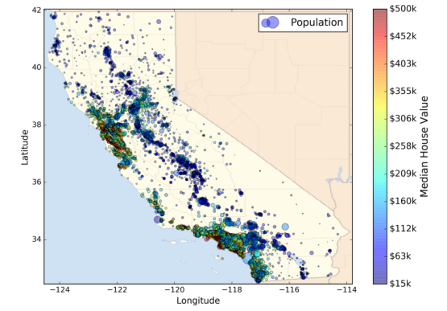

## **2.2 整体规划**

欢迎来到机器学习房地产公司！你的第一个任务就是根据 California 普查数据来建立一个房价预测模型。这份普查数据包含了 California 每个地区的人口、收入中位数、房价中位数等信息，每个地区人口大约 600 到 3,000 人。

你的模型应该对这些数据进行学习，然后根据提供的其它信息，预测任意地区的房价中位数。

### **2.2.1 划定问题**

首先第一个问题就是问你的老板商业目标是什么，构建一个模型可能不是最终的目标。公司期望如何使用这个模型并从中获利？这很重要，因为它决定了你如何划定问题，选择什么算法，使用什么性能测量方式来评估模型，以及在调试模型上花费多大的力气。

你的老板回答说你的模型输出（预测地区房价中位数）将连同许多其它信号传输到另外一个机器学习系统（如下图所示）。这个下游系统将决定是否对该地区投资房地产。得到正确的预测非常重要，因为它直接影响到收益。

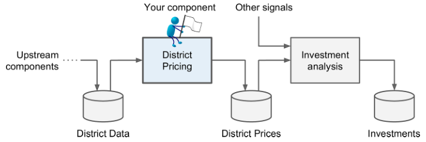

**管道（pipeline）**

数据处理组件的序列叫做数据管道（pipeline）。管道在机器学习系统中很常见，因为有许多数据要处理和转换。

管道的各个组件是异步进行的。每个组件都会输入大量数据并处理，然后将结果传输给管道的下一个组件，下一个组件继续处理并输出结果，依次进行。每个组件相对独立，组件之间的接口就是简单的数据存储。这让系统更加简单且容易掌控（借助数据流程图），不同的团队可以专注于各自的组件。而且，即便是某个组件崩溃了，下游组件仍然能使用之前上游输出的数据进行正常工作（至少在一段时间内）。这让整个系统更加健壮。

然而从另一方面来说，如果不能及时发现崩溃的组件，下游组件输入数据得不到及时更新，整个系统的性能也会下降。

下一个问题就是询问当前是如何预测房价的，作为你的模型的性能参考。你的老板回答说当前房价是由专家们进行人工预测的，方法是收集各个地区大量最新信息（除了房价），然后使用复杂的规则进行估计。这种做法成本高、费时间，而且正确率也不高，错误率达到了 15%。

好了，设计系统需要的所有信息已经准备好了。首先，你需要划定问题：这是监督式，非监督式，还是增强学习？这是分类任务，回归任务，还是其它任务？应该使用批量学习还是在线学习技术？在真正开始之前请先回答这些问题。

回答出来了吗？我们一起来看一下：这是一个典型的监督式学习任务，因为训练样本的标签是已知的（每个实例都有它的期望输出，例如各地区的房价中位数）。这也是典型的回归问题，因为我们的目标是预测房价。这也是多元回归问题，因为系统将使用多个特征进行预测（例如地区人课、收入中位数等）。在第一章预测居民幸福指数时，只有一个特征，人均 GDP，是一个单变量回归问题。最后，因为没有连续的数据流输入到系统，数据更新不是很频繁，而且数据量较小，所占内存不大，因此采用批量学习即可。

如果数据量很大，可以把整个数据集划分到不同的服务器上进行训练（使用 MapReduce 技术，后面将会讲到），或者你也可以使用在线学习技术。

### **2.2.2 性能指标**

下一步就要选择评估模型的性能指标。回归问题典型的性能指标是均方根误差（Root Mean Square Error, RMSE），即测量系统预测误差的标准差。例如，RMSE = 50,000 意味着有大约 68% 的预测值与真实值误差在 $50,000 之内，大约有 95% 的预测值与真实值误差在 $100,000 之内。计算 RMSE 的公式如下：

$$RMSE(X,h)=\sqrt{\frac1m\sum_{i=1}^m(h(x^{(i)})-y^{(i)})^2}$$

**符号**

这个公式引入了一些常见的机器学习符号：

- $m$ 表示样本个数，如果有 2,000 个样本实例，则 $m=2000$。

- $x^{(i)}$ 表示第 $i$ 个样本的所有特征值，$y^{(i)}$ 表示第 $i$ 个样本的标签（真实值）。例如第 1 个地区，经度 -118.29°，维度 33.91°，人口 1416，收入中位数 $ 28372，实际房价中位数为 $156400。则有：

$$
x^{(1)}=
\left[
\begin{matrix}
    -118.29 \\
    33.91 \\
    1416 \\
    28372
\end{matrix}
\right]
$$

$$y^{(1)}=156400$$

- $X$ 是包含所有样本特征值的矩阵（除了样本标签）。每一行是一个实例，第 $i$ 行是 $x^{(i)}$ 的转置，记为 $(x^{(i)})^T$。如下所示：

$$
X=
\left[
\begin{matrix}
    (x^{(1)})^T \\
    (x^{(2)})^T \\
    \cdots \\
    (x^{(1999)})^T \\
    (x^{(2000)})^T
\end{matrix}
\right]
=
\left[
\begin{matrix}
    -118.29&33.91&1416&28372 \\
    \vdots&\vdots&\vdots&\vdots
\end{matrix}
\right]
$$

- $h$ 是系统预测函数，也称为假设（hypothesis）。当给出一个实例的特征向量 $x^{(i)}$ 时，系统预测输出为 $\hat y=h(x^{(i)})$。例如第一个地区的预测房价为 158400，即 $\hat y^{(1)}=158400$，则预测误差为：$\hat y^{(1)}-y^{(1)}=2000$。

- $RMSE(X,h)$ 是损失函数。

除了 RMSE 之外，还有其它性能指标。例如出现某些离群点，这种情况下可以使用平均绝对误差（Mean Absolute Error, MAE）作为性能指标。公式如下：

$$MAE(X,h)=\frac1m\sum_{i=1}^m|h(x^{(i)})-y^{(i)}|$$

RMSE 和 MAE 都是用来测量两个向量 $h(x^{(i)})$ 和 $y^{(i)}$ 之间的距离，或称为范数。常见的范数包括：

- $l_2$ 范数，如 RMSE，计算的是两个向量的欧式距离，记为 $∥\cdot∥_2$ 或 $∥\cdot∥$。

- $l_1$ 范数，如 MAE，计算的是两个向量的曼哈顿距离，记为 $∥\cdot∥_1$。

- 其它范数 $l_k$。对于 $n$ 维向量 $v$，它的 $l_k$ 范数为： $∥v∥_k=(|v_0|^k+|v_1|^k+\cdots+|v_n|^k)^{\frac1k}$。$l_0$ 为汉明范数，计算的是向量的基数（即向量包含的元素个数），$l_{\infty}$ 是切比雪夫范数，表示的是向量中最大的绝对值。

- 范数指数越大，就越重视绝对值大的值，忽视绝对值小的值。这就是为什么 RMSE 比 MAE 对离群点更加敏感。但是，如果离群点是呈指数减小的（类似正态分布曲线），RMSE 通常也会表现得不错。

### **2.2.3 检查假设**

最后，最好列出目前为止做得所有假设并验证，这能帮助你尽早发现问题。例如你预测房价，然后传输到下游机器学习系统。但是，下游机器学习系统实际上把你预测得价格转换成了不同类别（例如便宜、中等、昂贵），使用这些类别代替实际预测值。这种情况下，准确预测房价并不是特别重要了！你只需要对房价进行类别划分即可。这样的话，这就是一个分类问题而不是回归问题。这是需要提前弄清楚的，你可不想建立回归模型之后才发现事实。

幸运的是，在与下游机器学习系统沟通之后，确认这确实是一个回归问题。好了，接下来就开始真正地编写程序了。

## **2.3 获取数据**

完整的代码在 GitHub 上获取，地址是：[https://github.com/ageron/handson-ml](https://github.com/ageron/handson-ml)。代码形式是 Jupyter Notebook。

### **2.3.1 创建工作环境**

首先你需要安装 Python，获取地址：[https://www.python.org/](https://www.python.org/)。

接下来需要创建一个工作空间目录，在终端输入以下命令（在提示符 $ 之后）：

```
$ export ML_PATH="$HOME/ml"     # You can change the path if you prefer
$ mkdir -p $ML_PATH
```

你还需要安装一些 Python 模块：Jupyter、Numpy、Pandas、Matplotlib 和 Scikit-Learn。如果你已经都安装好了，请直接跳过本节内容。如果没有，你可以使用多种方式来安装这些模块（包括它们的依赖）。你可以使用系统自带的包管理系统（例如 Ubuntu 上的 apt-get，或 macOS 上的 MacPorts、HomeBrew）；也可以安装 Python 的科学计算环境 Anaconda，使用 Anaconda 的包管理系统；或者直接使用 Python 自带的包管理系统 pip（自 Python 2.7.9 开始自带的）。你可以在终端输入以下命令来检查 pip 是否安装：

```
$ pip3 --version
```

>pip 9.0.1 from [...]/lib/python3.5/site-packages (python 3.5)

你应该安装 pip 的最新版本，至少是 1.4 版本以上的，以支持二进制模块的安装（也称为 wheels）。更新 pip 到最新版本的命令是：

```
pip3 install --upgrade pip
```

**创建独立环境**

如果你想创建一个独立的工作环境（强烈推荐！这样可以使不同项目之间不会出现库的冲突），输入以下 pip 命令来安装 virtualenv：

```
pip3 install --user --upgrade virtualenv
```

现在你可以创建一个独立的 Python 环境了：

```
$ cd $ML_PATH
$ virtualenv env
```

每次你想激活这个独立环境，只需打开一个终端输入以下命令：

```
$ cd $ML_PATH
$ source env/bin/activate
```

补充一下，如果代码写完，想关闭当前环境，输入以下命令：

```
$ deactivate
```

一旦环境激活之后，你使用 pip 安装的所有包都仅限于该独立环境中，Python 也只会访问这些包（如果你想访问系统其它包，可以在创建环境的时候使用 virtualenv 的 --system-site-packages 选项）。查看 virtualenv 的文档获取更多信息。

现在，你可以使用简单的 pip 命令来安装所有需要的模块和它们的依赖了：

```
$ pip3 install --upgrade jupyter matplotlib numpy pandas scipy scikit-learn
```

为了检查是否安装成功，可以使用以下命令导入所有模块：

```
$ python3 -c "import jupyter, matplotlib, numpy, pandas, scipy, sklearn"
```

没有错误的话，就可以输入以下命令打开 Jupyter Notebook 啦！

```
$ jupyter notebook
```

然后，一个 Jupyter 服务器就运行在你的终端了，监听端口 8888。你可以在浏览器中输入地址：http://localhost:8888/ 来访问服务器（通常在服务器启动时就自动打开了）。显示的目录即为你创建的当前环境。

现在可以创建 Python notebook 了。点击右上角 “New”，选择 “Python 3” 即可（如下图所示）。

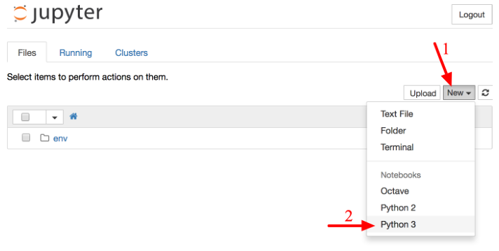

这个过程实际上做了三件事：1. 在当前工作空间里创建一个新的 notebook 未命名文件：Untitled.ipynb；2. 启动 Jupyter Python 核来运行这个 notebook；3. 在新栏中打开这个 notebook。你应该把这个 notebook 重命名为 Housing.ipynb。

Notebook 包含一个单元格列表。每个单元格可以放入可执行代码或者格式化文档。现在，notebook 只有一个空的代码单元格，名为 “In [1]”。在该单元格中输入：print("Hello world!")，点击运行按钮（如下图所示）或按键 Shift+Enter，就会把当前单元格内容发给 notebook 的 Python 内核中，运行并返回输出结果。结果显示在单元格下面，且会在底部建立一个新的单元格。可以点击菜单栏 Help 中的 User Interface Tour，学习更多 jupyter 的基本知识。

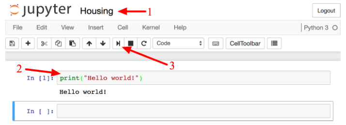

### **2.3.2 下载数据**

本项目需要下载的数据集是压缩文件 housing.tgz，解压后是 housing.csv 文件，包含所有数据。

你可以在浏览器上载数据集，然后使用命令 `tar xzf housing.tgz` 解压文件，提取出 housing.csv 文件。但是可以写一个程序来自动下载并解压。如果数据集有更新，你可以直接运行这个脚本，免得重复下载。而且，如果要将数据集下载到很多电脑上，使用程序的方法更加简单。

获取数据集的函数定义为：

```python
import os
import tarfile
from six.moves import urllib

DOWNLOAD_ROOT = "https://raw.githubusercontent.com/ageron/handson-ml/master/"
HOUSING_PATH = "datasets/housing"
HOUSING_URL = DOWNLOAD_ROOT + HOUSING_PATH + "/housing.tgz"

def fetch_housing_data(housing_url=HOUSING_URL, housing_path=HOUSING_PATH):
    if not os.path.isdir(housing_path):
        os.makedirs(housing_path)
    tgz_path = os.path.join(housing_path, "housing.tgz")
    urllib.request.urlretrieve(housing_url, tgz_path)
    housing_tgz = tarfile.open(tgz_path)
    housing_tgz.extractall(path=housing_path)
    housing_tgz.close()
```

直接运行函数：

```python
fetch_housing_data()
```

将会在你的工作空间新建目录 datasets/housing/。程序会自动下载 housing.tgz 文件并解压出 housing.csv 文件到 datasets/housing/ 目录下。

下面定义数据导入函数：

```python
import pandas as pd

def load_housing_data(housing_path=HOUSING_PATH):
    csv_path = os.path.join(housing_path, "housing.csv")
    return pd.read_csv(csv_path)
```

该函数会返回一个包含所有数据的 Pandas 的 DataFrame 对象。

### **2.3.3 快速查看数据结构**

先来看一下数据集的结构，运行以下语句，查看前 5 行：

```python
housing = load_housing_data()
housing.head()
```

显示结果如下：

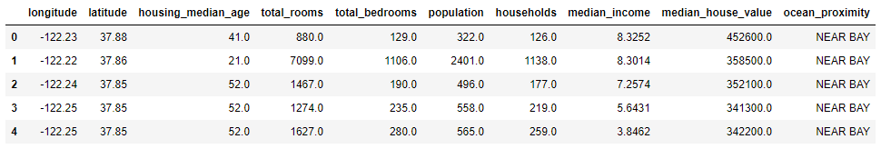

该数据集中每一行代表一个地区，每个地区包含 10 格特征属性，分别是：

- ongitude
  
- latitude
  
- housing_median_age

- total_rooms

- total_bed rooms

- population

- households

- median_income

- median_house_value

- ocean_proximity

使用  info() 方法来查看数据的整体描述，尤其是包含的行数，每个属性的类型和非空值的数量。

```python
>>> housing.info()

<class 'pandas.core.frame.DataFrame'>
RangeIndex: 20640 entries, 0 to 20639
Data columns (total 10 columns):
longitude             20640 non-null float64
latitude              20640 non-null float64
housing_median_age    20640 non-null float64
total_rooms           20640 non-null float64
total_bedrooms        20433 non-null float64
population            20640 non-null float64
households            20640 non-null float64
median_income         20640 non-null float64
median_house_value    20640 non-null float64
ocean_proximity       20640 non-null object
dtypes: float64(9), object(1)
memory usage: 1.6+ MB
```

可以看出数据集中总共有 20640 个实例。对于机器学习来说，数据量不算大，但非常适合入门使用。注意属性 total_bedrooms 只有 20433 个非空值。意味着有 207 个地区缺少这个特征值，我们将稍后处理这种情况。

所有属性都是数值类型，除了 ocean_proximity。ocean_proximity 的类型是一个对象，因此可能是任何类型的 Python 对象，但一旦你从 CSV 文件中导入这个数据，那么它一定是一个文本属性。之前查看前 5 行数据时，会发现该属性都是一样的，意味着 ocean_proximity 很可能是一个类别属性。可以通过使用 value_counts() 方法来查看该属性有哪些类别，每个类别下有多少个样本。

```python
>>> housing["ocean_proximity"].value_counts()

<1H OCEAN     9136
INLAND        6551
NEAR OCEAN    2658
NEAR BAY      2290
ISLAND           5
Name: ocean_proximity, dtype: int64
```

我们再来看以下其它字段。describe() 方法展示的是数值属性的总结：

```python
housing.describe()
```

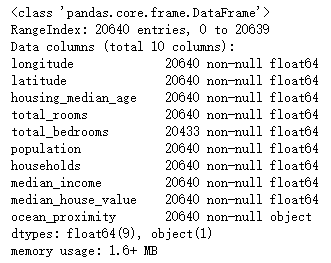

注意，以上的结果，空值是不计入统计的。其中，count 表示总数，mean 表示均值，std 表示标准差，min 表示最小值，max 表示最大值。

另外一种对数据集有个整体感知的方法就是对每个数值属性作柱状图。柱状图展示的是给定数值范围（横坐标）内所包含的实例总数（纵坐标）。你可以一次只画一个属性的柱状图，也可以对整个数据集使用 hist() 方法，将会对每个数值属性绘制柱状图。例如，从柱状图种可以看到有超过 800 个地区的房价中位数在 $500000 左右。

```python
%matplotlib inline # only in a Jupyter notebook
import matplotlib.pyplot as plt
housing.hist(bins=50, figsize=(20,15))
plt.show()
```

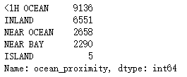

hist() 方法依赖于 Matplotlib()，而 Matplotlib() 又依赖于用户指定的图形后端来作图。因此，在作图之前你需要指定 Matplotlib 使用的后端，最简单的做法是使用 Jupyter 的魔术命令 `%matplotlib inline`。这行命令会使用 Jupyter 自带的后端并作图。注意在 Jupyter notebook 种调用 show() 不是必须的，因为单元执行时 Jupyter 会自动显示图形。

在这些柱状图种注意以下几点：

1.首先，收入中位数属性看起来并不是用标准的美元值来表征的。实际上收入中位数是经过了缩放和削顶处理的，削顶就是把大于 15 的都设为 15（实际上是 15.0001），把小于 0.5 的都设为 0.5（实际上是 0.4999）。在机器学习种，对特征属性进行预处理很常见。这不一定是个问题，但是你要试着明白数据是如何计算的。

2.房屋年龄中位数和房屋价格中位数也被削顶了。房价削顶可能是一个严重的问题，因为它是目标属性（标签）。削顶可能会让机器学习算法无法预测出界限之外的值。你应该好好检查一下削顶到底有没有影响，如果需要精准预测房价中位数，包括是界限之外的值，那么你有两种方法：

a. 对削顶的样本进行重新采集，收集实际数值。

b. 直接在训练集种丢弃这些削顶的样本（同时也对测试集这么做，因为如果房价中位数超过界限，预测结果可能就不好）。

3.这些属性的量度不同。稍后我们将详细讨论这一问题。

4.最后，许多柱状图有很长的尾巴：它们向右的拖尾比向左长得多。这可能会让一些机器学习算法检测模式变得更加困难。我们稍后会对这些属性进行转换，让它们更加接近于正态分布曲线。

### **2.3.4 创建测试集**

在这个阶段就搁置部分数据可能听起来比较奇怪。毕竟我们只是对数据有个初步的认识，在决定使用哪种算法之前应该对数据有更多的了解才是。没错，但是我们的大脑是个非常神奇的模式检测系统，它很容易就过拟合：如果查看了测试集，很容易就发现测试集中一些有趣的模式，致使我们倾向于选择符合这些模式的机器学习模型。当测量测试集的泛化误差时，结果往往会很好。但是，部署系统之后会发现模型在实际使用时表现得并不好。这种情况称为数据窥视偏差（data snooping bias）。

创建测试集理论上很简单：随机选择整个数据集大约 20% 的实例就可以了：

```python
import numpy as np
def split_train_test(data, test_ratio):
    shuffled_indices = np.random.permutation(len(data))
    test_set_size = int(len(data) * test_ratio)
    test_indices = shuffled_indices[:test_set_size]
    train_indices = shuffled_indices[test_set_size:]
    return data.iloc[train_indices], data.iloc[test_indices]
```

然后直接调用该函数：

```python
train_set, test_set = split_train_test(housing, 0.2)
print(len(train_set), "train +", len(test_set), "test")
```

> 16512 train + 4128 test

这种方法可行但并不完美！如果再一次运行程序，将会产生一个不同的测试集。多次之后，机器学习算法几乎已经遍历了整个数据集，这恰恰是我们应该避免的。

一种解决办法是把第一次分割的测试集保存起来供下次直接使用。另一种办法是在调用 `np.random.permutation()` 语句之前固定随机数发生器的种子（例如 `np.random.seed(42)`），这样每次产生的测试集都是相同的。

但是这两种方法在数据集更新的时候都会失效。一种常用的解决方法是使用每个实例的标志符来决定是否作为测试集（假设标识符是唯一且不变的）。例如，可以计算每个实例标识符的哈希值，只保留哈希值最后一个字节，如果该字节值小于等于 51（256 的 20%），则将该实例作为测试集。这保证了多次运行之后，测试集仍然不变，即时更新了数据集。新的测试集将会是所有新实例的 20%，且绝不会包含之前作为训练集的实例。下面是这种方法的代码实现：

```python
import hashlib

def test_set_check(identifier, test_ratio, hash):
    return hash(np.int64(identifier)).digest()[-1] < 256 * test_ratio

def split_train_test_by_id(data, test_ratio, id_column, hash=hashlib.md5):
    ids = data[id_column]
    in_test_set = ids.apply(lambda id_: test_set_check(id_, test_ratio, hash))
    return data.loc[~in_test_set], data.loc[in_test_set]
```

虽然，housing 数据集没有标识符这一列，但是最简单的办法是使用行索引作为标识符 ID：

```python
housing_with_id = housing.reset_index() # adds an `index` column
train_set, test_set = split_train_test_by_id(housing_with_id, 0.2, "index")
```

如果使用行索引作为唯一标识符，需要确保新的数据必须放置在原来数据集的后面，不能删除行。如果做不到的话，可以使用一个最稳定的特征作为标识符。例如，一个地区的经度和维度一定是唯一且百万年不变的，因此可以结合这两个特征来作为唯一标识符：

```python
housing_with_id["id"] = housing["longitude"] * 1000 + housing["latitude"]
train_set, test_set = split_train_test_by_id(housing_with_id, 0.2, "id")
```

Scikit-Learn 提供了一些划分数据集的函数，最简单的函数就是 `train_test_split`。该函数与之前定义的 `split_train_test` 基本一样，只是增加了一些额外功能。第一，参数 random_state 可以固定随机种子，效果跟之前介绍的一样。第二，可以对多个行数相同的数据集进行同样索引的划分（这非常有用，例如输入标签在另外一个 DataFrame 中）。

```python
from sklearn.model_selection import train_test_split
train_set, test_set = train_test_split(housing, test_size=0.2, random_state=42)
```

目前为止我们已经考虑了纯随机采样方法。当数据量足够大（特别是相对于特征属性个数）时，这种方法通常时可以的。但是如果数据量不够多，就会有采样偏差的风险。当一个调查公司想要咨询 1000 个人，询问他们一些问题时，他们的挑人的方法不是随机抽样，而是希望这 1000 个人对整个人口具有代表性。例如，美国人口中，女性占 51.3%，男性占 48.7%。因此，一个比较好的调查方式就是让抽样样本保持这样的性别比例：513 名女性，487 名男性。这种做法称为分层抽样（stratified sampling）：将总人口分成均匀的子分组，称为分层，从每个分层采样合适数量的实例，以保证测试集对总人口具有代表性。如果采样随机抽样，有 12% 的可能造成采样偏差：女性人数低于 49% 或高于 54%，调查结果可能就会出错。

假如专家告诉你收入中位数是预测房价中位数非常重要的属性之一。你希望确保测试集能够涵盖整个数据集中所有的收入类别。因为收入中位数是连续数值，你首先需要创建收入类别属性。让我们更仔细地看一下收入中位数柱状图（经过处理）。

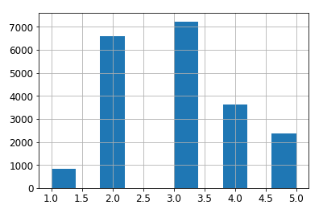

显然，大部分收入中位数都在 2-5（万美元） 之间，某些在 6 以上。数据集中每个分层都必须有足够多数量的实例，否则对某分层重要性的估计可能出现偏差。这就意味着不能有太多分层，每个分层应该有足够多的实例。下面的代码通过将收入中位数除以 1.5 来创建一个输入类别属性（除以 1.5 的目的就是为了防止类别过多）。使用 ceil 函数进行向上取整计算（得到离散类别），把所有大于 5 的归类到类别 5 中。

```python
housing["income_cat"] = np.ceil(housing["median_income"] / 1.5)
housing["income_cat"].where(housing["income_cat"] < 5, 5.0, inplace=True)
```

现在你就可以根据收入类别之间的比例来进行分层采样，可以直接使用 Scikit-Learn 的 StratifiedShuffleSplit 类来实现：

```python
from sklearn.model_selection import StratifiedShuffleSplit

split = StratifiedShuffleSplit(n_splits=1, test_size=0.2, random_state=42)
for train_index, test_index in split.split(housing, housing["income_cat"]):
    strat_train_set = housing.loc[train_index]
    strat_test_set = housing.loc[test_index]
```

我们来看一下实际效果是否符合预期，先计算整个数据集中各收入类别所占的比例：

```python
>>> housing["income_cat"].value_counts() / len(housing)

3.0    0.350533
2.0    0.318798
4.0    0.176357
5.0    0.114583
1.0    0.039729
Name: income_cat, dtype: float64
```

你可以使用类似的代码计算测试集中各收入类别的比例。下图比较了整个数据集、纯随机采样测试集、分层采样测试集三者之间收入类比的比例。可以看出，分层采样测试集的收入类别比例与整个数据集近似相同，而纯随机采样测试集与整个数据集相比产生了较大的偏差。

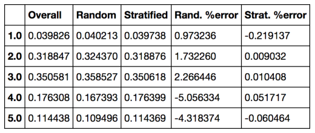

现在你可以把 income_cat 属性删除，让数据回到它的初始状态（income_cat 属性是为了进行分层采样的）：

```python
for set in (strat_train_set, strat_test_set):
    set.drop(["income_cat"], axis=1, inplace=True)
```

我们之所以花很多时间在划分测试集上，是因为在机器学习项目中这非常重要但却容易被忽视。更重要的，这些概念在我们之后讨论交叉验证（cross-validation）时会很有用。现在，我们开始进入下一阶段：探索数据。

Discover and Visualize the Data to Gain Insights

## **2.4 数据探索与可视化、发现规律**

目前为止，我们已经对数据有了初步的认识，大体上明白了我们要处理的数据类型。现在，我们将进入更深入的研究。

首先，确保已经划分了测试集并放置一边，我们只会对训练集进行操作。另外，如果训练集很大，可以从中采样一些作为探索集（exploration set），方便进行快速处理。在我们这个例子中，数据集比较小，所以直接在训练集上处理即可。我们还要创建一个训练集的复制副本，这样就不会改动原来的训练集了。

```python
housing = strat_train_set.copy()
```

### **2.4.1 地理数据可视化**

因为数据集中包含了地理位置信息（经纬度），所以创建所有地区的散点图来可视化数据是个好主意（如下图所示）。

```python
housing.plot(kind="scatter", x="longitude", y="latitude")
```

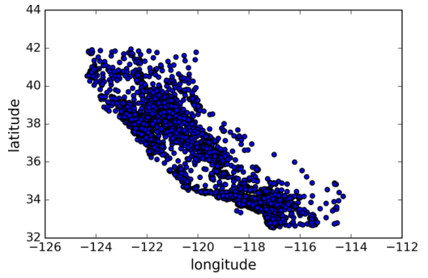

This looks like California all right, but other than that it is hard to see any particular pattern. Setting the alpha option to 0.1 makes it much easier to visualize the places where there is a high density of data points (Figure 2-12):

这看起来有点像加州，但是很难看出任何规律。我们设置参数 alpha = 0.1，这样就更容易看出数据点的密度了（如下图所示）。

```python
housing.plot(kind="scatter", x="longitude", y="latitude", alpha=0.1)
```

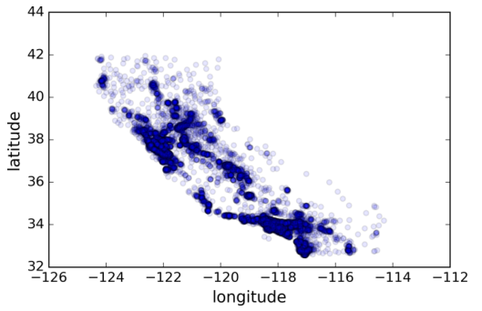

现在，我们可以很清晰地看出这些密度较大的区域了。

通常来说，人类的大脑非常善于发现图片中的模式，但是也需要使用一些可视化参数来让这些模式更加突出。

接下来，我们来看一下房屋价格（如下图所示）。其中，圆的半径代表地区人口（参数 s），圆的颜色代表房价（参数 c）。我们将使用预先定义好的颜色图 jet（参数 cmap），颜色范围从蓝色（低房价）到红色（高房价）。

```python
housing.plot(kind="scatter", x="longitude", y="latitude", alpha=0.4,
    s=housing["population"]/100, label="population", figsize=(10,7),
    c="median_house_value", cmap=plt.get_cmap("jet"), colorbar=True,
    sharex=False)
plt.legend()
save_fig("housing_prices_scatterplot")
```

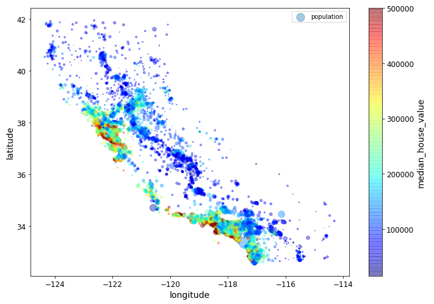

注意，参数 `sharex=False` 修复了显示 x 轴和 legend 不显示的 bug。感谢 Wilmer Arellano 给的建议。出处：[https://github.com/pandas-dev/pandas/issues/10611](https://github.com/pandas-dev/pandas/issues/10611)。

这张图显示出房价与地理位置（例如沿海）和人口密度关系很大，这一点你可能早就知道。可以使用聚类算法检测主要的聚集，增加新的特征测量到聚类中心的距离。尽管加州北部沿海地区的房价并不高，但是 ocean_proximity 属性仍然非常有用。总的来说，预测房价并不是使用一个简单规则就行的。

### **2.4.2 寻找关联性**

因为数据集不是很大，我们可以使用 corr() 方法直接计算任意两个属性的标准相关系数（也称皮尔逊相关系数）。

```python
corr_matrix = housing.corr()
```

现在，我们来看一下每个属性与房价中位数的相关系数分别是多少：

```python
>>> corr_matrix["median_house_value"].sort_values(ascending=False)

median_house_value 1.000000
median_income 0.687170
total_rooms 0.135231
housing_median_age 0.114220
households 0.064702
total_bedrooms 0.047865
population -0.026699
longitude -0.047279
latitude -0.142826
Name: median_house_value, dtype: float64
```

相关系数范围在 [-1, 1] 之间，越接近 1 表示正相关性越强，例如房价中位数与收入中位数。相关系数越接近 -1 表示负相关性越强。你可以看到房价中位数与维度呈现负相关性（数据显示越往北方，房价呈下降趋势）。最后，相关系数接近 0 表示无线性相关。下图展示了 x 轴与 y 轴对应数据的相关系数。

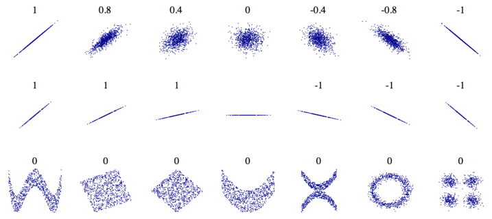

相关系数仅仅测量的是线性相关性（如果 x 增大，y 也同样增大或减小），可能完全忽略非线性关系（例如，x 在 0 附近，y 会增大）。注意，上图中最下面的那几张图表示的都是相关系数为零的情况，但是它们是非线性相关。第二行展示的几个图形相关系数为 1 或 -1，注意与直线的斜率无关。

另外一种检查不同属性特征之间的相关系数的方法是使用 Pandas 的 `scatter_matrix` 函数。它将对每个数值属性与其它所有数值属性的相关性进行作图。因为现在有 9 个数值属性，总共有 9x9=81 个图，页面放不下这么多。所以，我们只选择几个与房价中位数关系较大的属性来作图。

```python
from pandas.tools.plotting import scatter_matrix

attributes = ["median_house_value", "median_income", "total_rooms",
"housing_median_age"]
scatter_matrix(housing[attributes], figsize=(12, 8))
```

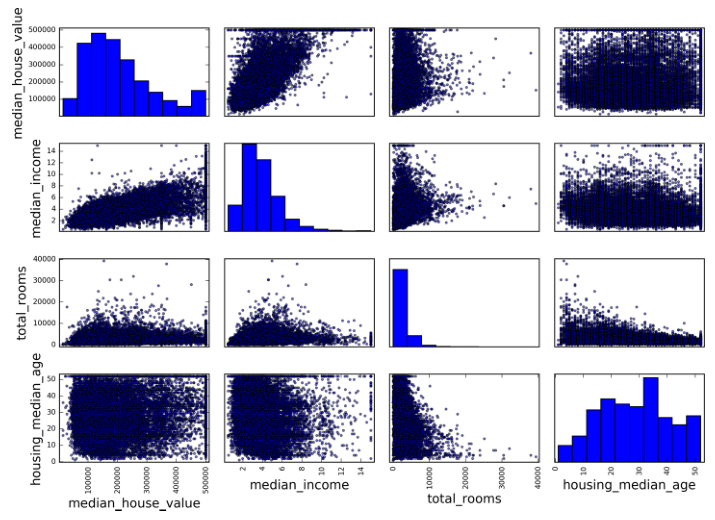

上图中，主对角线对应的相关系数全是直线（自己与自己的相关系数始终为 1），作图没有实质意义，因此显示的实际上是每个属性的柱状图。关于其它选项设置，可以参阅 Pandas 的文档。

The most promising attribute to predict the median house value is the median
income, so let’s zoom in on their correlation scatterplot (Figure 2-16):

看起来，最有可能用来预测房价中位数的属性是收入中位数，让我们把该图放大来看：

```python
housing.plot(kind="scatter", x="median_income", y="median_house_value",
alpha=0.1)
```

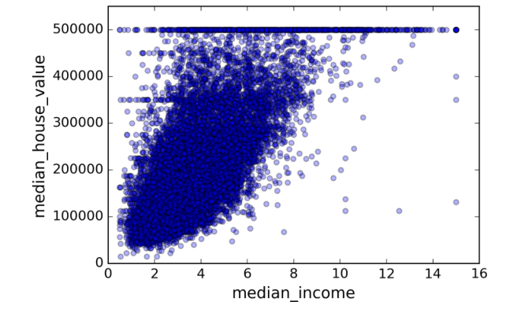

这张图说明了几点：第一，相关性较强。你可以清楚看到数据点整体呈上升趋势，并不分散。第二，我们之前提过的价格上限 $500,000 呈现一条水平直线。同样在 $450,000、$350,000 和 $280,000 的位置也呈现了较弱的水平直线。在训练模型的时候最好移除这些样本点，防止算法学习到这些不好的数据。

### **2.4.3 尝试结合不同的属性**

希望前面的章节给了你一些探索数据、获取规律的方法。你发现了一些数据怪癖，在把数据放入机器学习算法之前，将其清除。你也发现了不同属性之间的相关性，尤其是与目标属性的相关性。你也注意到有些属性呈现长尾分布，可以进行转换处理（例如计算它们的对数）。当然，不同项目的处理方法并不完全相同，但是大致思路是类似的。

在准备数据给机器学习算法之前，你还可以尝试进行不同的属性组合。例如，如果你不知道地区有多少户，只知道地区总的房间数也没什么作用。你最想知道的是每户有多少房间。类似地，知道卧室数量也没什么用，你可能需要将其与房屋数量进行比较。还有，每户人口数应该也比较重要。下面，我们来创建这些属性：

```python
housing["rooms_per_household"] = housing["total_rooms"]/housing["households"]
housing["bedrooms_per_room"] = housing["total_bedrooms"]/housing["total_rooms"]
housing["population_per_household"]=housing["population"]/housing["households"]
```

现在，我们再来看一下相关矩阵：

```python
>>> corr_matrix = housing.corr()
>>> corr_matrix["median_house_value"].sort_values(ascending=False)
median_house_value 1.000000
median_income 0.687170
rooms_per_household 0.199343
total_rooms 0.135231
housing_median_age 0.114220
households 0.064702
total_bedrooms 0.047865
population_per_household -0.021984
population -0.026699
longitude -0.047279
latitude -0.142826
bedrooms_per_room -0.260070
Name: median_house_value, dtype: float64
```

看起来还不错！`bedrooms_per_room` 属性与房价中位数的相关性比单独的 `total_rooms` 和 `total_bedrooms` 与房价中位数的相关性更大。可以看出，`bedroom/room` 比值越小，房价越高。`rooms_per_household` 属性也比 `total_rooms` 包含了更多的信息——显然，房屋越大，价格就越高。

这一轮的探索不一定要非常完备。重要的是正确开始并快速发现一些规律，这将帮助你得到第一个合理的原型。这是一个迭代的过程：一旦你得到一个原型开始运行，你就可以分析它的输出，发现更多规律，然后回过头来继续探索数据，不断优化模型。

## **2.5 为机器学习算法准备数据**


